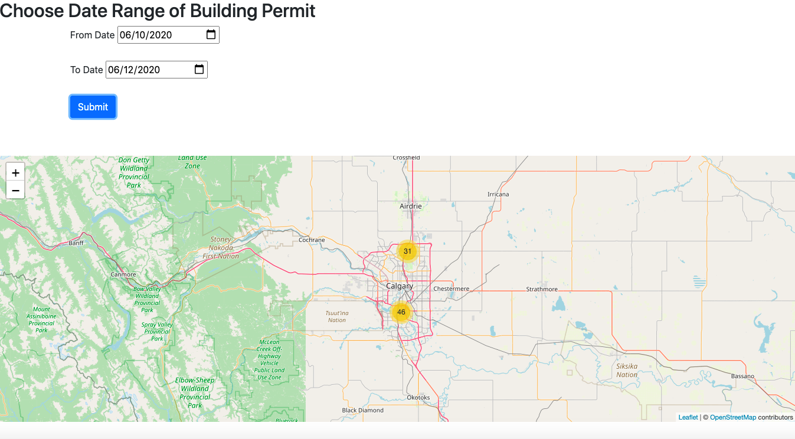
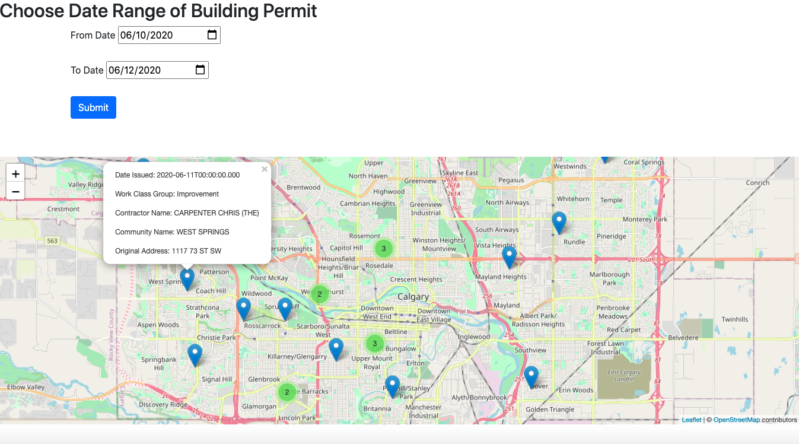

# Project2 Leaflet.js Building Permit Map
A web application that uses leaflet.js API and the City of Calgary API to map building permits in Calgary AB based on the permit issue date.

## The Map & Search
When a User is enters the site they are brought to a map centered at Calgary's City Centre. Above the map is a a date search widget where a user can select two dates. These dates can be the same or different and this will search the City of Calgary's API for building permits whose issue dates are within that date range. 

## The Output
There may sometimes be a high number of data points on the map, making it look cluttered. To fix this, high density point areas are clustered at certain zoom levels.

The extent of the points within these clusters can be seen by the user if they place their cursor over the point.

Clicking on a cluster or manually zooming in will provide more identifiable areas as clusters or individual points.

In some scenarios, one location may have multiple building permits.

If a multiple permit location is clicked the points will expand, allowing for easily vision and selection for the user.

Finally, information such as the permits: 

Issue Date, 
Working Class Group, 
Contractor Name,
Community Name,
and Original Address

Will appear for each point when clicked as a popup menu.

